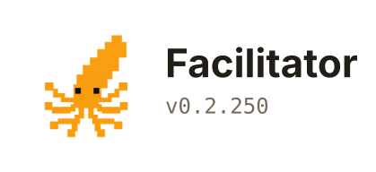

<p align="center">
  
</p>

## About 

Facilitator is a natural language development environment. It is an interface built to resolve *the* bottleneck when coding with agents: [understanding](https://www.geoffreylitt.com/2026/07/02/understanding-is-the-new-bottleneck).

**Facilitator makes it super easy to atomize your asks and orchestrate dozens of subagents.** The interface speeds up your development and helps you ship faster and better in following ways:
1. If you are working on a large spec, you can develop different parts of the spec independently, quickly delegating the portions that are simple, and spending more time on parts that require greater attention
2. If you want to ship *n* features or resolve *n* bugs, you can do so independently on *n* different cards, where the task on each is handled by a subagent in a worktree
3. The tickets on the left show you which cards are waiting for your input and which ones are busy
4. Hotkeys make it easy to triage tasks; you can quickly defer features and bugs that should be dealt with later
5. After iterating a bit on a project using the Facilitator, the cards serve as that project's knowledge bank, owned by you, and easily queryable by agents

Facilitator is meant to complement your existing development workflow. **To make the best of the Facilitator**:
- Atomize your asks
- Learn the hotkeys
- Dispatch subagents
- Triage & ship!

## Installation

**Pre-requisites**:
- Claude Code or Codex
- Google Chrome
- macOS

Installing the Facilitator is easy:
```
git clone https://github.com/AsteroidHunter/facilitator.git
cd facilitator
./install.sh
```

**Once installed**

1. On your favorite terminal:
`facilitator run`
2. Start a Claude or Codex session, and run `/facilitator onboard` in Claude Code and `$facilitator onboard` in Codex
3. Open a project on the facilitator, press `command + T` to open a new card, and start shipping!

### Mobile version
The Facilitator comes with a mobile version. The mobile version is fun to use when paired with an external keyboard. 

If you have an always on machine (or like to leave your laptop running), you can access your project on the Facilitator and direct agents as long as you have **Tailscale**. 

To use the mobile version:
1. Run `facilitator bridge`
2. Scan the QR code using your phone
3. Follow the steps to set up the web app
4. Continue shipping!

## Updating the Facilitator

Facilitator is still in development and will be constantly updated. To update, run the following on your terminal:
```
facilitator update
```

## License

This project is released under the [Facilitator License 1.0.0](LICENSE.md). Contributions are accepted under the terms in [CONTRIBUTING.md](CONTRIBUTING.md).

The bundled CodeMirror editor (`cm-markdown.js`) is included under its own MIT license; see [THIRD-PARTY-NOTICES.md](THIRD-PARTY-NOTICES.md).
